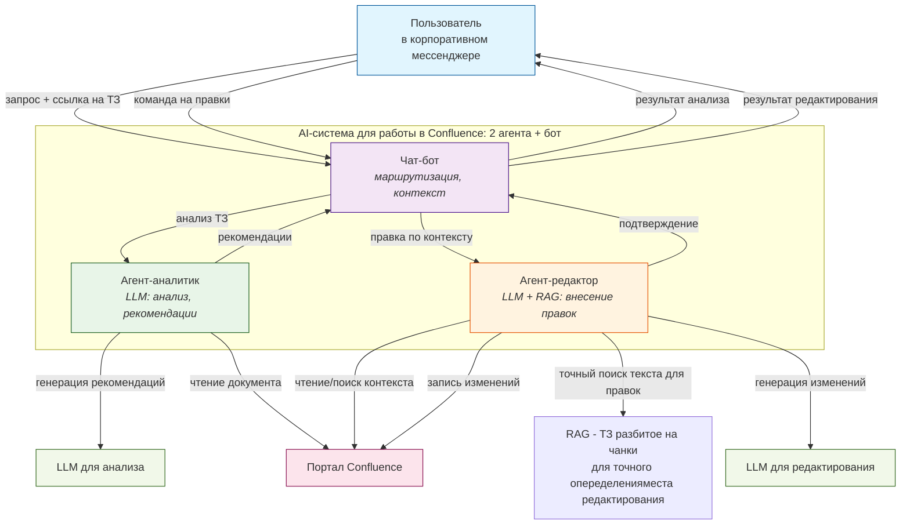

```mermaid
%%{init: {'flowchart': {'nodeSpacing': 20, 'rankSpacing': 50}} }%%
flowchart TD
    User[Пользователь<br>в корпоративном мессенджере]

    subgraph SG["<div style='width: 400px; text-align: center'>AI-система для работы в Confluence: 2 агента + бот</div>"]
        Bot[Чат-бот<br><i>маршрутизация, контекст</i>]
        Analyst[Агент-аналитик<br><i>LLM: анализ, рекомендации</i>]
        Editor[Агент-редактор<br><i>LLM + RAG: внесение правок</i>]
    end

    Confluence[Портал Confluence]
    LLM_Analyst[LLM для анализа]
    LLM_Editor[LLM для редактирования]
    RAG_Editor[RAG - ТЗ разбитое на чанки<br>для точного опеределенияместа редактирования]

    %% Основной поток
    User -- "запрос + ссылка на ТЗ" --> Bot
    Bot -- "анализ ТЗ" --> Analyst
    Analyst -- "генерация рекомендаций" --> LLM_Analyst
    Analyst -- "чтение документа" --> Confluence
    Analyst -- "рекомендации" --> Bot
    Bot -- "результат анализа" --> User

    %% Поток редактирования
    User -- "команда на правки" --> Bot
    Bot -- "правка по контексту" --> Editor
    Editor -- "чтение/поиск контекста" --> Confluence
    Editor -- "точный поиск текста для правок" --> RAG_Editor
    Editor -- "генерация изменений" --> LLM_Editor
    Editor -- "запись изменений" --> Confluence
    Editor -- "подтверждение" --> Bot
    Bot -- "результат редактирования" --> User

    %% Стилизация
    style User fill:#e1f5fe,stroke:#01579b
    style Bot fill:#f3e5f5,stroke:#4a148c
    style Analyst fill:#e8f5e8,stroke:#1b5e20
    style Editor fill:#fff3e0,stroke:#e65100
    style Confluence fill:#fce4ec,stroke:#880e4f
    style LLM_Analyst fill:#f1f8e9,stroke:#33691e
    style LLM_Editor fill:#f1f8e9,stroke:#33691e

```
